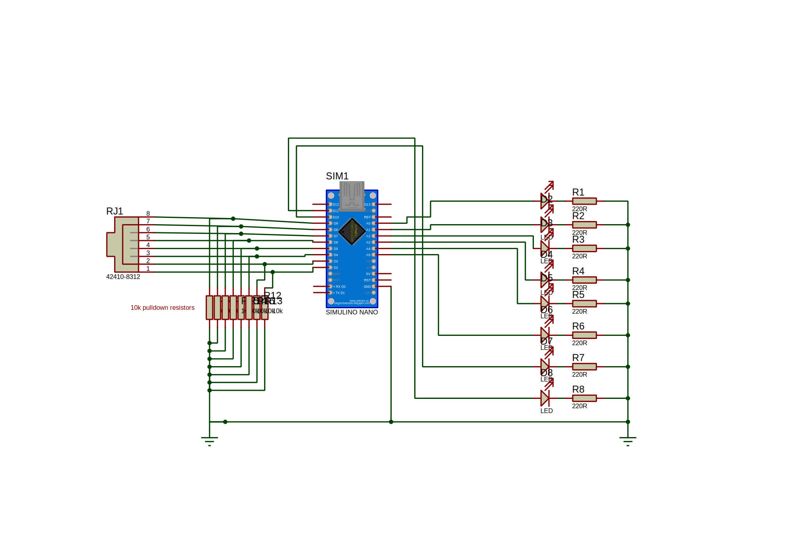
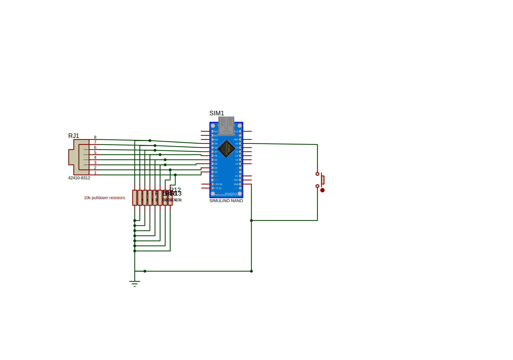

## RJ45 Cable Tester
A two-unit homemade RJ45 cable tester using Arduino. This project consists of a sender and a receiver unit that work together to test the integrity of Ethernet cables wired according to the T568B standard.

Project Overview
The RJ45 Cable Tester helps in identifying issues with Ethernet cables by checking the continuity of each wire within the cable. The tester uses LEDs to indicate the status of each wire, making it easy to spot any miswirings, shorts or faults.

# Hardware Components
2x Arduino Nano (or compatible)
2x RJ45 Female Jack
8x LEDs (for visual indication)
16x 10kΩ Resistors (used for pull-downs to avoid erratic behavior)
8x 220Ω Resistors (used for limiting the LEDs' current)
Connection wires, a lot of em.
The project includes two images showing the circuit diagrams for the sender and receiver units:

### Receiver Unit

### Sender Unit

RJ45 Pinout
The RJ45 port is wired according to the T568B standard. The connections to the Arduino are made as follows:

Arduino Pin      RJ45 Pin	    Wire Color (T568B Standard)
2	                  8	        Brown
3                   7        	Brown/White
4                   6	        Green
5                  	5         Blue/White
6                  	4        	Blue
7                  	3        	Green/White
8                  	2        	Orange
9                  	1        	Orange/White

This wiring is crucial for testing each wire in the Ethernet cable sequentially, ensuring that the tester can accurately identify any faults or miswirings.

How It Works
Connection: Plug the RJ45 cable to be tested into the sender unit.
LED Indicators: Each LED corresponds to a wire within the cable. If a wire is correctly connected, the corresponding LED will light up on the receiver unit.
The LED on the far right will test the brown wire, and the one next to it will test the brown/white wire.
Testing Process: The Arduino sends signals through each wire in the cable and checks for continuity. If there is a break in the wire, the corresponding LED will not light up, indicating a fault.
### Installation and Setup
Assemble both circuits.
Upload the provided Arduino code to both the sender and receiver Arduino units.
Connect the RJ45 cable to the sender and receiver units.
#### Notes
Feel free to change the on time of the LEDs according to your own needs.
You also may only connect the sender unit to power, and power will be transmitted through the cable to the receiving unit, that is why the sender always sends a HIGH signal at first power.
Feel free to change the connections to the standard used in your own country.
Suggestions are welcome!

License
This project is licensed under the GNU General Public License v3.0. See the LICENSE file for more details.
